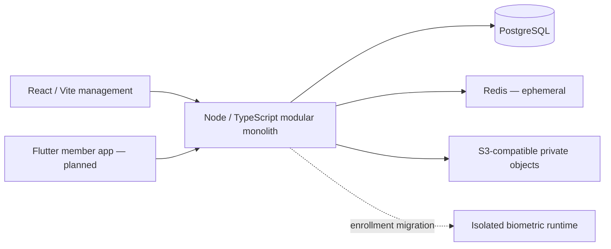

# ERTAD foundation architecture

Status: initial architecture, 2026-10-01. This document describes decisions and future acceptance gates; it does not claim those domain features are implemented.

The detailed [DTG migration plan](MIGRATION.md) defines actual source-module reuse, preservation of local changes/tests, Zero Trust acceptance, web/mobile transfer order and rollback. It refines the phase overview below: presentation migration starts in P1; authenticated shells complete in P4 after their security dependencies.

## Scope and runtime

V1: identity/enrollment/recovery/private profiles; organizations, units, memberships, permission/scope, approvals/audit; work; basic text communication/moderation; decisions; Activity and Qualifications; operational hardening.
V1.5: referrals, subscriptions, public-figure/organization channels, QR, advanced discovery.
V2: XP, levels, recognition, optional bounded leaderboards and challenges. V1 has no dependency on these.

Development: API and Vite run on the host with hot reload; Compose runs the three data dependencies. The optional `apps` profile runs API, one-shot migrations and nginx/web for CI parity. API has no product data routes yet: `/api/v1/*` rejects unauthenticated traffic. Production mode refuses startup.

## Module ownership and dependencies

| Owner | Entities | Dependencies |
|---|---|---|
| Identity | User, Profile, IdentityVault, Device, Session | Security audit; external document/PAD providers |
| Organization | Organization, Unit, Membership, Position, permission bundle | User opaque IDs; Approval |
| Work | WorkItem, WorkItemRole, Assignment; thin Event later | scoped authorization; Qualifications |
| Communication | Channel, Message, delivery state; Subscription in V1.5 | Membership/Assignment authorization; Moderation |
| Decisions | Decision, electorate snapshot, Participation, Ballot | membership snapshot; privacy policy |
| Activity | Activity, Qualification; Referral/Contribution later | verified sources, no authority grant |
| Governance | Approval, versioned declarative Definition | explicit permissions; AuditEvent |
| Security | AuditEvent, external checkpoints, ModerationCase | opaque IDs; key management |

Module tables remain in one PostgreSQL database. Modules expose explicit operations, not unrestricted shared table access. Do not create empty layers or services ahead of a vertical slice. Redis is disposable and cannot be the source of votes, approvals, activity or membership truth.

## Data model constraints (planned, not migrated)

- UUID opaque internal IDs. Profile discovery IDs are random, nonsequential and distinct from primary keys. User default visibility PRIVATE. Effective disclosure is the most restrictive user, organization, field and context policy.
- Tenant-owned records use `organization_id NOT NULL`. Composite `(organization_id,id)` foreign keys prevent cross-tenant links. Tenant/status/time indexes support bounded list queries. No public enumerable membership directory.
- Unit has at most one authority parent in its organization; reject cycles transactionally. Professional affiliation never creates a second authority parent. Membership connects user, unit, versioned position and validity interval; index active membership lookup and test expiry/revocation.
- Permission bundle grants operation + scope, never a role-name shortcut. Approval stores request author, immutable payload/version, independent approver, reason, expiry and outcome. Revalidation occurs at execution; mutations of a pending payload invalidate approval.
- IdentityVault is separate from public profile and sessions. Encrypt sensitive fields with externally managed keys; normal modules receive opaque user IDs. Exact legal identifiers and biometric media never enter audit payloads.
- WorkItem parent allocations and Assignment final-slot allocation use transactions/row locks; unique assignment/application keys and payload-bound idempotency prevent duplicates. Qualification revocation is checked on acceptance/assignment.
- Activity is append-oriented, with corrections/reversals tied to source records. Financial/referral events cannot affect governance eligibility. No XP columns are needed in V1.
- Decision snapshots eligibility when opening. Participation is unique per `(decision_id,user_id)`. Ballot contains randomized ID, decision ID, choice and coarse timestamp only: no user/device/identity/participation foreign key or reusable request correlation ID. Schema and telemetry tests must cover indirect joins. Minimum anonymous electorate is 10; organizations may raise it, never lower it. Suppress revealing small/unanimous breakdowns.
- Private profile attributes support EXACT, BUCKETED, SHARED_CONTEXT_ONLY, HIDDEN; rare attributes/context combinations are generalized at default k>=10. Exact-ID search is authorized and rate-limited; no prefix enumeration.
- Sessions distinguish mobile and privileged web. Privileged browser authentication needs HttpOnly/Secure/SameSite cookies, CSRF protection, MFA, expiry, step-up and revocation before domain administration exists.

## Authorization matrix (policy examples, not hard-coded roles)

Every permission requires active membership plus scope. Independent approval and identity grants remain additional checks for every row.

| Position template | Permitted scope | Example operations | Explicit exclusions |
|---|---|---|---|
| Member | own/shared permitted unit | read permitted work, opt in, participate in eligible decision | directory enumeration, administrative grants |
| Team Manager | assigned team/subtree | allocate and verify team work | self-approval; protected identity by rank |
| Group Manager | group subtree | unit/member operations and delegation where granted | unrelated groups; own promotion approval |
| Regional Manager | region subtree | cross-group allocation, scoped reporting | other regions; vault access by rank |
| Professional Manager | professional unit | qualification review and professional work | geographic authority merely by profession |
| Platform Administrator | explicitly assigned platform/organization scope | definitions, security configuration, audited support | universal allow; ballot-voter linkage; unapproved identity reveal |

Bootstrap: one-time eligible installation, explicit mode, initial administrator set, MFA, confirmation/audit, permanently disabled afterwards. No secret permanent root. Break-glass, if implemented, has reason, limited permissions, short TTL, MFA, immediate alert, audit and post-event review; privacy boundaries remain.

## Threat model and privacy inventory

| Threat | Asset / path | Planned mitigation | Residual exposure if control fails |
|---|---|---|---|
| Server compromise | runtime and keys; malicious deployment | least privilege, patching, secret separation, signed releases, incident rotation | runtime can observe decrypted requests; not protected by DB encryption alone |
| Full database copy | identity, membership graph, messages, votes | field encryption, separate keys, opaque IDs, minimized logs, unlinkable ballots | membership graph and timing metadata may remain identifying; pseudonyms are not anonymity |
| Server seizure / infrastructure administrator | disks, backups, secrets | external KMS, encrypted backups, separate access, external checkpoints | available runtime keys or simultaneous key compromise defeats confidentiality |
| Device theft/seizure | sessions, cached data | secure storage, local minimization, remote revocation, step-up | unlocked device/screens may expose permitted content |
| Legal request | membership/identity records | documented request review, minimization, retention controls | compelled disclosure limits require qualified review; no promise of immunity |
| Network blocking | service availability | explicit offline state, bounded retries, tested recovery | service may remain unreachable; no silent offline votes |
| Compromised platform admin | permission grants/identity access | permission+scope, MFA, independent approval, alerts/checkpoints | colluding approvers or privileged infrastructure access remain threats |
| Malicious manager | unit member/candidate identity | minimized projections, scope checks, disclosure thresholds | contextual knowledge can identify rare members |
| Sybil/farm | enrollment/duplicate accounts | verified person uniqueness across documents, rate limits, review | document fraud/provider false accepts remain |
| Deepfake/media injection | biometric assurance | reviewed PAD provider, injection-risk signals, attestation, manual appeal | measured FAR/FRR/PAD quality is UNKNOWN until evaluated |
| Notification provider | sensitive content/relationship metadata | content-free default, explicit policy+opt-in for non-sensitive previews | delivery destination/timing remain visible |
| Ballot-deanonymizing insider | choice/participation link | separated schema, coarse timestamps, randomized IDs, restricted logs, result suppression | low turnout and infrastructure timing observation remain; no absolute anonymity claim |

Data inventory: direct identifiers (vault, encrypted); pseudonymous IDs (profile/discovery, policy-controlled); biometrics (temporary encrypted review artifacts with explicit TTL/purge); organization/membership (sensitive graph); qualifications (possible quasi-identifiers); messages (private content and metadata); decisions (separated participation/ballots); audit/security (opaque actors, minimal payload, retained integrity history).

Legal/privacy decisions are **UNRESOLVED**: Georgian law and GDPR applicability, biometric processing basis, sensitive membership treatment, residency, retention/erasure, processor terms, notification processors, DPIA need. Obtain qualified review before real enrollment. No legal conclusion or real-person data processing is implemented in this foundation. Adults-only is a product default; a concrete age rule and enforcement require the enrollment decision.

## Enrollment migration gates

Review DTG document/camera/device adapters. NFC DG1/DG2 reads alone do not establish authenticity: supported eMRTD flow needs SOD/passive authentication and signer chain against an appropriate CSCA trust source, plus active/chip authentication where supported. Provider/trust source and actual device results are UNKNOWN.
PAD covers photo/video replay, deepfake and media injection. Record actual provider metrics, face-match thresholds and false-reject/manual-review behavior. Keyed stable-person matching must handle passport and ID belonging to the same person; document-number uniqueness alone is insufficient. Device attestation informs risk and never weakens recovery. Temporary media retention requires encryption, purpose, access restrictions, TTL and purge tests.

## Interface architecture

Mobile has exactly Status / Messages / Home / Tasks / Polls; Home emphasized centrally in a safe-area floating pill. V1 Status shows Activity, Qualifications and permitted Membership. No platform console, leaderboard or endless feed. Shared task/decision/event/profile/activity cards cover loading/empty/error/offline/pending states.
Web is one permission-aware management application. Group/region/professional/platform surfaces derive from capabilities and scope. Shared dialogs, filter bar, field validation, tables and state components use semantic design tokens. Georgian/English and system/light/dark are required. Web adapts DTG layout; mobile uses a distinct day/night family.

## Migration sequence and rollback

| Phase | Deliverable / gate | Rollback |
|---|---|---|
| P0/P1 | read-only source assessment, isolated foundation, reviewed design/architecture | stop only ERTAD processes; retain project volumes |
| P2 | identity/enrollment/recovery/private profile | feature disabled; no DTG data changes; restore drill before migration |
| P3 | organization/authorization/approval/audit/bootstrap | additive schema, deny-by-default feature gates; tested backup |
| P4 | actual Flutter and authenticated web shells | retain previous signed client/API compatibility |
| P5 | work/roles/assignments | additive migration and transaction/idempotency tests |
| P6 | basic channels/system notifications/moderation | disable delivery adapters; retain canonical records |
| P7 | decisions/privacy | no destructive ballot migration; reviewed explicit recovery plan |
| P8/P9 | Activity/Qualifications; promotion/sensitive access | append compensations; expire grants |
| P10/P11 | events/funding records/analytics; hardening/deployment | release rollback + measured restoration |
| P12 / V1.5 | network features | separate scope and feature rollout |
| P13 / V2 | gamification | derived state removable; authority unchanged |

DTG production data existence and disposition are UNKNOWN. No migration/archive/discard operation is authorized by local infrastructure setup. Full DTG security audit is pending; see [source assessment](SOURCE_ASSESSMENT.md).

## Acceptance gates

Foundation: deterministic install/build, unit/contrast checks, publication guard, Docker readiness, local API/web smoke, browser interactions/responsive widths, restricted role and restore probe. Future tests are **pending**, not fulfilled by foundation health:

- P2: invalid SOD/trust chain/replayed or injected media; duplicate person; false reject/recovery; attestation risk; default Private; no legal-name leak; temporary artifact purge (privacy/identity invariants).
- P3: correct/wrong permission and scope, expired membership, self-grant/self-approval denial, bootstrap non-reuse, break-glass alerts/audit if enabled, mobile-class denial, hash-chain and externally signed checkpoint verification.
- P5: concurrent final slot, child allocation capacity, idempotency conflict, revoked qualification and cancellation.
- P6: mute/block/moderation, content-free third-party defaults, deleting notification preserves source record.
- P7: ballot cannot join to participant, electorate floor 10, revealing-result suppression, logs/idempotency do not relink votes.
- P8/P9: immutable correction history, financial/referral/gamification non-authority, field grants expire.
- P12/P13: opt-in subscription, referral alone cannot broadcast, reward deduplication, private discovery anti-enumeration, rare attribute generalization, optional leaderboard, excused/organizer-cancelled events do not penalize reliability.

Scale goals are not validated capacity: 100k registered, 10k active; p95 read <300ms, write <800ms, authorization <20ms, message ACK <500ms. Initial realtime test hypothesis: 10k mostly idle connections and 100 message writes/s, fanout <=100; confirm workloads before P6. Test REST, realtime, notifications, decision transitions and search separately.
Recovery targets: RPO <=15min/RTO <=4h, requiring production PITR/encrypted offsite copies and timed drills. A local dump/restore does not satisfy these production targets.
